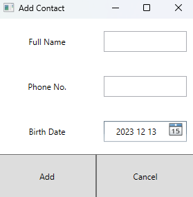

# About

Phonebook Windows application. Add, Edit, and Delete contacts. Contacts are stored in a database.

## Main Window

Main Window where you can see the list and three buttons - Add, Edit, Delete.

## Add Window

Pressing the "Add" button in the Main Window you get a window that lets you add a new contact. Pressing the "Cancel" button will close this window without adding any new contact.

## Edit Window

After selecting a contact in the list of Main Window and pressing the "Edit" button an Edit Window will be open with inputs filled with data of selected contact from the Main Window. Changing them and pressing the "Edit" button will update the selected contact.
Pressing the "Cancel" button will close this window without updating the contact.

## Delete

Pressing the "Delete" button in the Main Window while having a contact selected will delete the selected contact.

## Database

The application is connected to a local MS SQL Server Database where contacts are stored. The application/database uses Stored Procedures to handle queries.

# Launching (to be updated)

To launch this application you can follow these steps:
1. Setup MS SQL Management Studio (https://learn.microsoft.com/en-us/sql/ssms/download-sql-server-management-studio-ssms?view=sql-server-ver16)
2. In MS SQL create a database called "PhoneBookDB"
3. In MS SQL Create a table using the "CreatePhoneBookTable" Stored Procedure
4. In the "App.config" file change the Data Source name to your MS SQL Server Name
5. Compile the code using your preferred IDE/method

In the future there will be a built application that should not require compiling and require only setting up MS SQL and the Server Name should be changed easily (a JSON/text config file or something similar).

# Test Related Files

Everything related to quality assurance. Simple test plans describing what and how will the application be tested. The test plans are divided into three main parts: Main Window, Adding a contact, and Editing a contact. The folder also includes test cases.